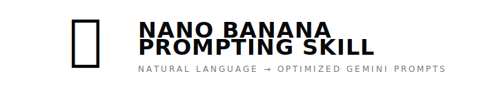

<p align="center">
  
</p>

---

Your agent's image prompts are mid. This skill fixes that.

**Transform natural language into optimized structured prompts** for Gemini 3 Pro Image. Part of the GClaw skill library — loaded into any agent that has the image-generation tools enabled.

You say *"a gecko eating pizza on a skateboard"* → the skill builds a detailed JSON prompt with camera specs, lighting, materials, composition → Gemini produces a cinematic result instead of AI slop.

## Before / After

Same model (Gemini 3 Pro Image). Same subject. Different prompting.

| Plain Prompt | With This Skill |
|:---:|:---:|
|  |  |
| *"a gecko in a hoodie by a barrel fire"* | *Structured JSON with Sony A7IV, 35mm f/1.4, Kodak Portra 400, chiaroscuro lighting...* |

| Plain Prompt | With This Skill |
|:---:|:---:|
|  |  |
| *"sunflowers in watercolor"* | *Structured JSON with cold press paper, wet-on-wet technique, limited palette...* |

## How It Works

```
You: "generate a gecko coding at night"
         │
         ▼
    ┌──────────────────────┐
    │  Skill detects style │ → Cinematic / Photorealistic
    │  Builds JSON prompt  │ → Camera, lens, lighting, film stock, mood...
    └──────────┬───────────┘
               │
               ▼
    Agent calls generate_image(prompt=<json>, filename=…)
               │
               ▼
    🖼️ Cinematic quality output
```

The skill doesn't add new scripts or dependencies. It teaches any agent with `generate_image` in its tool allowlist **how to prompt** — using structured JSON templates optimized for each visual style.

## Supported Styles

The agent **auto-detects** the right style from the request, or the user can specify one:

| Style | Example Request |
|-------|----------------|
| 🎬 **Cinematic / Photo** | "a portrait of an old fisherman at golden hour" |
| 📸 **Product / Studio** | "product shot of a perfume bottle on marble" |
| 🖌️ **Illustration** | "concept art of a floating city" |
| 🌸 **Anime / Manga** | "anime girl on a train, Makoto Shinkai style" |
| 🧸 **3D / Pixar** | "cute robot character, Pixar style" |
| 🎨 **Watercolor** | "paint me some sunflowers, watercolor" |
| ✏️ **Minimalist** | "flat design icon of a mountain" |
| 🌀 **Surreal** | "a clock melting over a desert, Dalí style" |

## Install

Ship this skill as part of GClaw:

1. Drop the directory at `skills/nano-banana-prompting/`.
2. Register it in Firestore via the `/admin/skills` UI, or let the boot-time discovery (`SkillRegistry.load_builtins`) pick it up on the next start.
3. Grant it to any agent whose allowlist should include it from the `/admin/agents/<name>` Skills tab.

### Requirements

- `GEMINI_API_KEY` (or Vertex ADC) set in the deploy environment
- Image tools enabled on the target agent: `generate_image`, `generate_image_b64`, and optionally `context_write_image` for persistence

## Usage

Just talk to the agent naturally:

- *"Generate a photo of a cat in a coffee shop"*
- *"Draw me a dragon in watercolor style"*
- *"Make a Pixar-style robot holding a flower"*
- *"Create an anime scene of a girl reading in the rain"*
- *"Product shot of headphones on a dark background"*
- *"Surreal painting of a whale flying through clouds"*

The agent reads `SKILL.md`, detects the style, builds the optimized JSON, and calls `generate_image`. Zero manual prompting needed.

## Why Structured Prompts?

Plain text prompts leave too much to chance. The model fills in blanks with generic defaults.

Structured JSON prompts specify:
- **Camera & lens** (for photorealistic — Sony A7IV, 85mm f/1.8)
- **Film stock** (Kodak Portra 400, CineStill 800T)
- **Lighting setup** (three-point, golden hour, chiaroscuro)
- **Art technique** (wet-on-wet, cel shading, impasto)
- **Render engine** (Pixar RenderMan, Blender Cycles)
- **Composition** (rule of thirds, leading lines, negative space)
- **Color palette** (specific colors, not "colorful")
- **Negative prompt** (what to avoid — text, artifacts, wrong style)

The result: consistent, professional-quality images every time.

## Examples

See [`SKILL.md`](SKILL.md) for full JSON examples for every style.
